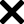

<!-- Don't delete it -->
<div name="readme-top"></div>

<!-- Organization Logo -->
<div align="center" style="display: flex; align-items: center; justify-content: center; gap: 16px;">
  
  
  
</div>

&nbsp;

<!-- Organization Name -->
<div align="center">

[](https://www.dummy-url.com/)

<!-- Correct deployed url to be added -->

</div>

<!-- Organization/Project Social Handles -->
<p align="center">
<!-- Telegram -->
<a href="https://t.me/StabilityNexus">
</a>
&nbsp;&nbsp;
<!-- X (formerly Twitter) -->
<a href="https://x.com/StabilityNexus">
</a>
&nbsp;&nbsp;
<!-- Discord -->
<a href="https://discord.gg/YzDKeEfWtS">
</a>
&nbsp;&nbsp;
<!-- Medium -->
<a href="https://news.stability.nexus/">
  </a>
&nbsp;&nbsp;
<!-- LinkedIn -->
<a href="https://linkedin.com/company/stability-nexus">
  </a>
&nbsp;&nbsp;
<!-- Youtube -->
<a href="https://www.youtube.com/@StabilityNexus">
  </a>
</p>

---

<div align="center">
<h1>A Modular Web3 Auction Platform with Multi-Protocol Support</h1>
</div>

## Table of Contents

- [About](#about)
- [Key Features](#key-features)
- [Tech Stack](#tech-stack)
- [Smart Contracts](#smart-contracts)
- [Getting Started](#getting-started)
- [Contributing](#contributing)

## About

<!-- Correct url to be added -->

[Hammer Auction House](https://www.dummy-url.com) is a decentralized auction platform that redefines digital asset trading on blockchain. Users can participate in a variety of auction types with full transparency and security provided by smart contracts.

---

## Key Features

- **Multiple Auction Types:** Supports English, Dutch, All-Pay and Vickrey auctions for both NFTs and ERC-20 tokens.
- **Smart Contract Security:** Trustless execution with on-chain validation and verifiable, immutable transactions.
- **NFT & Token Trading:** List, bid on, and win ERC-721 NFTs and ERC-20 tokens.
- **Wallet Integration:** Seamless MetaMask and Web3 wallet support.
- **Transparent History:** Fully on-chain transaction records and bid history.
- **Extensible Services:** Modular auction services interface to support future auction mechanisms.

---

## Tech Stack

**Frontend**

- Next.js 14+ (React)
- TypeScript
- TailwindCSS
- shadcn/ui

**Blockchain**

- Wagmi
- Solidity Smart Contracts
- Ethers.js
- Rainbow-Kit Wallet Integration

---

## Getting Started

### Prerequisites

- Node.js 18+
- npm/yarn/pnpm
- MetaMask or any other web3 wallet browser extension

### Installation

#### 1. Clone the Repository

```bash
git clone https://github.com/StabilityNexus/HammerAuctionHouse-WebUI.git
cd HammerAuctionHouse-WebUI
```

#### 2. Install Dependencies

Using your preferred package manager:

```bash
npm install
# or
yarn install
# or
pnpm install
```

#### 3. Run the Development Server

Start the app locally:

```bash
npm run dev
# or
yarn dev
# or
pnpm dev
```

#### 4. Open your Browser

Navigate to [http://localhost:3000](http://localhost:3000) to see the application.

---

## Smart Contracts

Smart contract code powering auction logic can be found at
**[HammerAuctionHouse-Solidity](https://github.com/Stability-Nexus/HammerAuctionHouse-Solidity)**.

Contracts implement support for English, Dutch, All-Pay and Vickrey auction variants. See the Solidity repo for deployment,and method references.

---

## Contributing

We welcome contributions of all kinds! To contribute:

1. Fork the repository and create your feature branch (`git checkout -b feature/AmazingFeature`).
2. Commit your changes (`git commit -m 'Add some AmazingFeature'`).
3. Run the development workflow commands to ensure code quality:
   - `npm run format:write`
   - `npm run lint:fix`
   - `npm run typecheck`
4. Push your branch (`git push origin feature/AmazingFeature`).
5. Open a Pull Request for review.

If you encounter bugs, need help, or have feature requests:

- Please open an issue in this repository providing detailed information.
- Describe the problem clearly and include any relevant logs or screenshots.

We appreciate your feedback and contributions!
